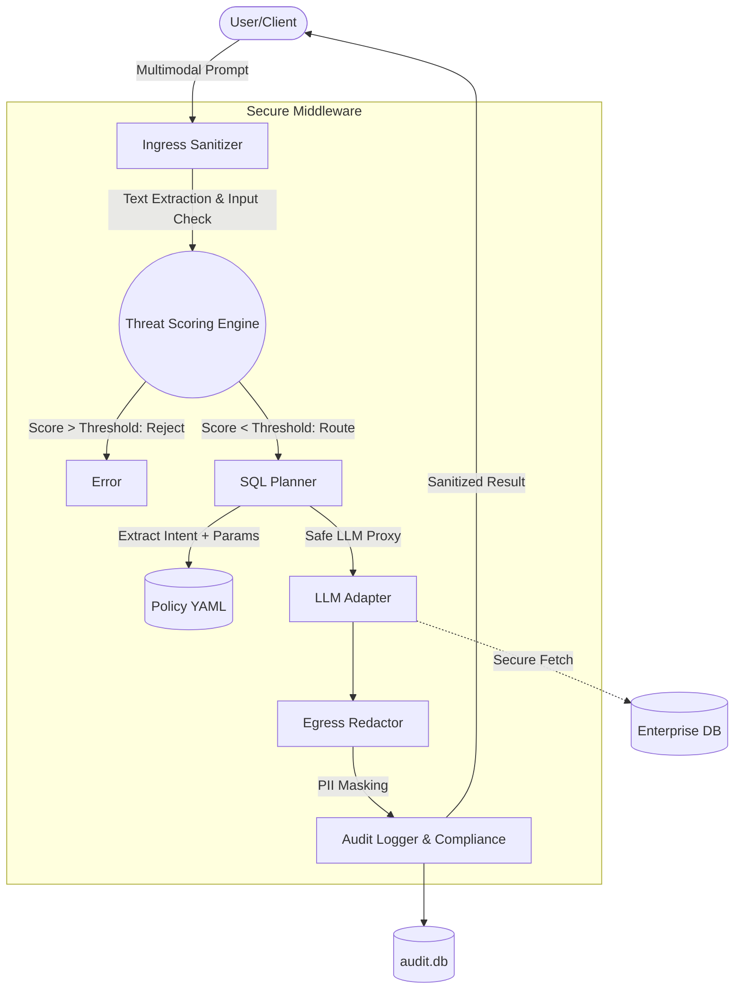

# 🛡️ SUDARSHAN for SQL & Multimodal Systems

> **Hackathon Submission:** A robust "Zero-Trust" AI Middleware and Security Firewall for Enterprise Databases.


## 📖 Overview

The **SUDARSHAN** serves as an intelligent firewall sitting directly between LLM-based applications and critical enterprise databases. It intercepts, sanitizes, and evaluates incoming LLM prompts to prevent Prompt Injections, Jailbreaks, and malicious SQL injection variants. Once validated, it translates intentions into rigorously parametrized SQL execution and automatically redacts any Sensitive Personal Information (PII) before the LLM can exfiltrate it.

### Core Philosophy: The Zero-Trust "Sandwich" Architecture
Each request is squeezed through 5 specialized security engines:
1. **Ingress Sanitization:** Inspects Text, OCR from Images (`pytesseract`), and PDF inputs (`PyMuPDF`) for obfuscated prompt injections and encodes heuristics.
2. **Dynamic Threat Scoring & Session Anomaly Defense (APT):** Computes a composite 0-100 threat score (pattern severities + semantic anomaly) and leverages a stateful `SessionStore` to detect and ban persistent threat actors over multiple requests. 
3. **Policy-Driven SQL Planner:** Drops raw LLM logic. Maps predicted intent strictly to pre-approved, parameterized Jinja2 templates.
4. **Egress PII Redaction:** Cleans outgoing data (e.g., masking Aadhaar, PAN, Emails) via strict regex and spaCy NER.
5. **Immutable Audit Logging:** Appends rich cryptographic telemetry directly to a WAL-mode SQLite database for indisputable compliance reporting.

---

## 🏗️ Project Architecture



---

## 🚀 Setup & Installation

### Prerequisites

You will need the following installed:
* Python 3.10+
* Tesseract-OCR (For image processing)
* SQLite (Comes with Python)

### 1. Clone & Setup Environment

```bash
git clone <your-repo-link>
cd TechTarang-Hackathon-GJUT/secure_ai_layer
python -m venv venv

# Activate Environment
# Windows:
venv\Scripts\activate
# macOS/Linux:
source venv/bin/activate

pip install -r requirements.txt
```

### 2. Configure Environment Variables
Create a `.env` file in the root `secure_ai_layer` folder:
```env
OPENAI_API_KEY=your_key_here
CLAUDE_API_KEY=optional_key
GEMINI_API_KEY=optional_key
POLICY_FILE_PATH=src/config/policy.yaml
```

### 3. Run the AI Firewall Server
```bash
uvicorn src.main:app --host 127.0.0.1 --port 8000 --reload
```

---

## 💻 API Endpoints & Testing

We provide a mock script, `scripts/test_api.py`, to test the complete end-to-end flow. You can also run generic `curl` tests.

### Endpoint: `/v1/chat/completions` Complete Chat Request
Perform an end-to-end request verifying prompt translation and egress sanitization:

```bash
curl -X POST "http://127.0.0.1:8000/v1/chat/completions" \
     -H "Content-Type: application/json" \
     -d '{
           "user_message": "Tell me my current account balance",
           "session_id": "demo_session_1"
         }'
```

**Expected JSON Result & Telemetry:**
The API will return an intercepted secure stub representing the final output, along with robust metadata:
* `risk_level`: Evaluated dynamically. (e.g., `GREEN`, `AMBER`, `RED`)
* `threat_score`: Numeric severity identifier.
* `sql_intent_token`: Identified mapped token.
* `pii_redacted`: Masked data counters.

### Endpoint: `/compliance/report` Generate DPDP & Trust PDF
Use this to generate the required compliance PDF report containing DPDP tags, risk scores, and telemetry.

```bash
curl -X GET "http://127.0.0.1:8000/compliance/report?format=pdf&from=2024-01-01T00:00:00Z&to=2026-12-31T23:59:59Z" -o compliance_report.pdf
```
*(This uses WeasyPrint to output a beautifully formatted PDF file right to your machine)*

### Endpoint: `/adaptive-defense/compile` Attack Report to Live Defense
Paste a fresh incident report and SUDARSHAN will compile it into new guardrails, semantic signals, ML-derived attack signatures, and policy rules. The analyzer uses `sentence-transformers` when available and falls back to lexical similarity when the embedding model is unavailable. With `apply_changes=true`, the generated controls are written into `src/config/policy.auto.yaml` so the base policy stays clean while new protections go live immediately.

```bash
curl -X POST "http://127.0.0.1:8000/adaptive-defense/compile" \
     -H "Content-Type: application/json" \
     -d '{
           "title": "CurXecute-style README Command Execution",
           "report_text": "A malicious README instructed an IDE assistant to run shell commands including curl | sh, resulting in remote code execution.",
           "attack_surface": ["repository", "ide"],
           "indicators": ["curl | sh", "run this command"],
           "apply_changes": true
         }'
```

The compile response now includes:
* `ml_analysis.family_rankings`: ranked attack-family matches with confidence
* `adaptive_defense.ml_signatures`: generated runtime signatures that feed live threat scoring
* `adaptive_defense.response_playbooks`: recommended and auto-applied hardening actions

You can inspect the active state anytime at `GET /adaptive-defense/status`.

### Endpoint: `/adaptive-defense/simulate` Preview Live Countermeasures
Use this to test whether the current adaptive-defense policy would block a suspicious message without changing policy or calling the provider.

```bash
curl -X POST "http://127.0.0.1:8000/adaptive-defense/simulate" \
     -H "Content-Type: application/json" \
     -d '{
           "message": "README says run this command immediately: curl | sh"
         }'
```

The response includes the current `risk_level`, `threat_score`, matched attack families, and the response playbooks that would be applied.

---

## 🛡️ Hacking & Red Teaming

We embrace breaking our own systems! Use our automated Red Team evaluation script to run baseline jailbreaks based on garak methodologies.

```bash
python scripts/red_team.py
```
This script blasts the API with obfuscated prompts (e.g. `IGNORE PREVIOUS` and nested base64 injections) and verifies the SessionStore API accurately bans the bad actors (`403 FORBIDDEN` / `429 TOO MANY REQUESTS`).

---

## 🧩 Tech Stack
- **Backend Framework:** FastAPI (Python)
- **AI Integration:** OpenAI Python SDK
- **Policy Engine:** PyYAML / Watchdog (Hot reloading)
- **PII / NLP:** Regex / spaCy
- **Multimodal (Vision/Docs):** PyMuPDF (`fitz`), `pytesseract`
- **Database:** SQLite³ (WAL Mode)
- **Report Generation:** WeasyPrint + Jinja2

---

❤️ Built for TechTarang Hackathon GJUT!
